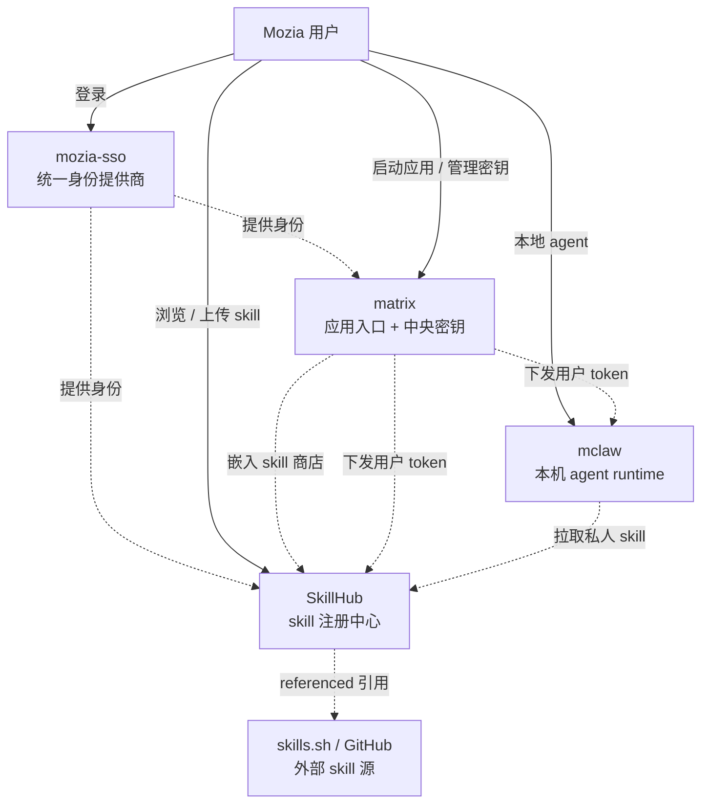

# SkillHub · 战略与路线图

> 受众：技术团队 / 跨产品（matrix · mclaw · mozia-sso）/ 上级管理层
> 用途：一文了解 SkillHub 是什么、为什么做、做到了哪、接下来去哪、需要谁配合
> 维护：每个 Phase 节点更新一次

---

## 📌 TL;DR（30 秒）

> **SkillHub 是 Mozia 生态里的 agent skill 注册中心。** 它有三个面孔：(1) Mozia 团队封装的 skill 第一信息源（兼软宣传）；(2) Mozia 各产品共享的 skill 后端（matrix 嵌入式商店 + mclaw 用户私人 skill 库）；(3) Mozia 用户自助上传 skill 的个人仓库（git 风格 public/private）。
>
> **当前进度：** Phase 0（本机骨架）+ Phase 1（mozia-sso 接入）已完成；**Phase 2 主体功能已交付**——用户能上传发布、CLI 能装走 private skill、URL 命名空间和身份模型已稳定；剩下 spec 04（matrix 嵌入 + 跨生态身份统一）待启动。AI 辅助开发节奏波动较大，按里程碑滚动汇报，不预设具体交付日。
>
> **生态定位三条主线：**
> - 🪪 **身份**走 mozia-sso（已对接，单点登录）
> - 🔑 **密钥**走 matrix 中央 token 系统（spec 04 集成；Mozia 各产品一把 key 通行）
> - 📦 **skill 内容**走 SkillHub（owned 在自家 DB / referenced 引用 GitHub）

---

## 一、SkillHub 是什么

**一句话**：Mozia 生态里的 agent skill 注册 + 分发中心，对标公开生态里的 [skills.sh](https://skills.sh)，但定位是 **Mozia 旗下基础设施**。

### 三种身份并存

| 身份 | 内容来源 | 主要消费者 |
|---|---|---|
| **(1) Mozia 第一信息源** | Mozia 团队封装的 owned skill | SkillHub 自家前端 + matrix 内嵌商店 + 公网 |
| **(2) 生态 skill registry** | (1) + (3) 的统一目录 | matrix 商店页 / mclaw runtime 拉取用户 skill |
| **(3) 用户个人 skill 仓库** | mozia-sso 用户自助上传 | 用户自己（private）+ 公网（public）|

### 与 skills.sh 的两点核心差异

1. **包含 Mozia 第一方内容**——团队封装的 skill 在这里有"出品方"印章，对外起到产品/方法论展示作用
2. **与 matrix/mclaw 原生集成**——不是孤立站点，是 Mozia 这套 agent 工具链的内嵌组件

### ❗ 不是什么

> 避免被错位理解：
>
> - **不是公开的开放市场** —— 没有第三方机构入驻、没有交易、不做内容审核工作流
> - **不是 npm/pypi 那种代码包仓库** —— skill 是 markdown 文档（SKILL.md）+ 可选附件，不是可执行 binary
> - **不是替换 anthropic.com/skills** —— 后者是 Anthropic 官方的全球公开仓库；我们对内 + 对接 Mozia 自己的工具

---

## 二、Mozia 生态拓扑

> ℹ️ **三个连接点：** matrix 嵌入 skill 商店（UI 复用 `Explore.tsx`）；matrix 中央密钥直通 SkillHub（spec 04）；mclaw 用同一把 key 拉用户 skill。

---

## 三、为什么做（业务理由）

| 角度 | 说明 |
|---|---|
| **拓展 Mozia 工具链** | matrix（应用入口 + 部署引擎）+ mclaw（agent runtime）+ SkillHub 形成"能用 / 能装 / 能部署"的完整链路 |
| **第一方内容分发** | Mozia 团队产出的 skill（产品方法论、行业模板、内部最佳实践）有官方分发通道，不必散落在各处 |
| **用户粘性** | mozia-sso 用户在 SkillHub 上传 skill → mclaw 自动拉取 → 在 matrix 部署的应用里调用，**生态闭环**，提高用户留存 |
| **轻量级软宣传** | 公开的 owned skill 在 SEO + 社区分享时挂 "Mozia 出品" 标识，**变相产品营销**，零额外投入 |

---

## 四、当前状态

### ✅ Phase 0 · 本机骨架

- [x] `skillhub.skills` + `skillhub.skill_files` schema
- [x] API：`/api/skills` 列表、`/api/skills/...` 详情、`/api/tags`
- [x] 协议端点：`/.well-known/agent-skills/index.json`、`/.well-known/agent-skills/.../SKILL.md`
- [x] 前端：列表 + 详情 + Docs（参照 skills.sh 排行榜布局）
- [x] 数据：5 owned + 4 referenced skill（精选引用 anthropics/skills）
- [x] CLI 兼容：`npx skills add http://localhost:3333 ... --agent claude-code -y` 端到端可用

### ✅ Phase 1 · 接入 mozia-sso

- [x] 后端 better-auth + generic OIDC 接 mozia-sso（Casdoor）
- [x] 测试服 SSO（`116.136.189.21:8778`）已注册 application `mozia-skills-hub`
- [x] 用户能在网页 Sign in / Sign out，cookie session 工作

### ⏳ Phase 2 · 进行中

- [x] **01 · visibility 模型** — `visibility` enum = `public` / `private`（git 风格二档）
- [x] **02 · 用户上传 + URL 命名空间** — `skills.owner_user_id` + `(owner, slug)` 复合唯一；POST/PUT/DELETE skill + 文件 CRUD；`/publish` 表单含**本地文件夹拖拽**（自动识别 SKILL.md root、收 sibling 为 extras、过滤 `.DS_Store` / 嵌套 dotdir）；`/u/:owner` 作者页；URL 格式 `<owner>/<slug>` + 旧 URL 302 兼容；用户 `name`(display) ↔ `handle`(URL slug) 双字段
- [x] **03 · CLI 安装 private skill** — capability URL：服务端 mint 一次性 token，URL 本身就是凭据，CLI 完全无感（24h TTL / 单次失效 / 审计日志）
- [ ] **04 · matrix embed + 跨产品身份统一** — matrix 内嵌 "Skill 商店" 页（复用 matrix 已有 `Explore.tsx` 组件）；SkillHub 接入 matrix 中央 token 系统（用户在 matrix 已有的 key 直接通行 SkillHub）

### 已部署位置

- 本地开发：`localhost:3333`（api）+ `localhost:5180`（web）+ `localhost:36915`（pg）
- 测试服 SSO：`http://116.136.189.21:8778`（已对接）
- **SkillHub 测试服部署**：尚未；Phase 2 完成后推进

### 文档与代码索引

- 仓库：`/Users/apple/Desktop/work/Mskills`（本地路径；远程 `MoziaVerse/mozia-skillhub`）
- Phase 0 spec：`docs/spec/phase-0/`
- Phase 1 spec：`docs/spec/phase-1/01-auth.md`
- Phase 2 spec：`docs/spec/phase-2/`（00 总纲 + 01-04 子 spec）
- mozia-sso 对接手册：`/Users/apple/Desktop/work/mozia-sso/docs/skillhub-onboarding.md`（分支 `feat/skillhub-onboarding-doc`）
- 本地启动 / 测试 / 故障排查：仓库根 `README.md`

---

## 五、Phase 2 路线图

### 目标

把 SkillHub 从"工程师 PR + seed JSON"的内部货架，升级为：

- [x] 用户自助发布 skill（git 风格 public/private 命名空间）
- [x] CLI 一行命令装走 private skill（capability URL）
- [ ] matrix 内嵌 "Skill 商店"，无缝消费 SkillHub 数据
- [ ] SkillHub 鉴权与 matrix 中央 token 系统打通（mclaw / 任何 Mozia 产品共用一把 key）

### 子 Spec 总览

- [x] **01 · visibility cleanup** — enum 简化、清理 Phase 1 残留
- [x] **02 · user upload** — schema 扩展、CRUD、命名空间、handle 拆分、上传 UI
- [x] **03 · CLI 私域安装** — capability URL（CLI 透明）、详情页"一次性安装命令"
- [ ] **04 · matrix embed + 中央鉴权** — matrix backend proxy + frontend skill 商店；SkillHub Bearer auth → matrix token introspect

> **关于工作量：** 具体日历时间会因 AI 辅助效率波动，按里程碑通报，不锁定预估。matrix 团队的具体投入由他们自己评估。

### 三个验收 Demo

- **Demo A · 用户上传 + 私域分发** ✓ 已通过：登录 → `/publish` 拖入 skill 文件夹 → 自动填表选 private → 详情页 "Generate one-time install command" → 终端粘贴 → SKILL.md 落 `~/.claude/skills/<owner>/<slug>/`
- **Demo B · matrix 嵌入式 skill 商店** ⏳ 待 spec 04：matrix 左侧 nav "Skill 商店" → 列表（matrix 视觉风格）→ 详情 + 安装命令
- **Demo C · 跨产品身份统一** ⏳ 待 spec 04：用户在 matrix 已有 UI 创建一把 token → mclaw / 任何脚本拿这把 token 调 SkillHub `/api/users/me/skills` → 拿到该用户的 skill 列表

### 同期推进的运维事项

- **测试服部署**（同域反代避免跨域 cookie）
- **真实 owned skill 内容补 5-10 条**（通过 `/publish` 上传或 seed JSON + git PR）

---

## 六、跨团队依赖

### 🟢 mozia-sso（Casdoor）

> ✅ **状态：已对接，运行中。**

**已对接的事**：
- 测试服 application `mozia-skills-hub` 已注册
- redirect URI 走通配 regex（`^https?://localhost...`），新部署 IP 无需逐条加白名单
- Token 字段已配齐（email / displayName / phone / Owner / Groups / roles / permissions / IsAdmin / Affiliation 等 12 项）

**Phase 2 期需要 mozia-sso 协助的事**：
- **生产 application 注册**（部署生产时一次性，redirect URI 加生产域名）
- 暂无其他改动需求

### 🟦 matrix（重头戏）

matrix 在 Mozia 生态里承担两个对 SkillHub 关键的角色：

1. **应用入口** —— 用户在 matrix 里看到 "Skill 商店" tab，无缝浏览/安装 SkillHub 的内容
2. **中央密钥发放** —— Mozia 各产品的 Bearer 鉴权统一到 matrix 已有的 token 系统（mclaw 调模型 API 用的就是这套 key），形成"身份走 mozia-sso、密钥走 matrix"的双引擎

**Phase 2 spec 04 期需要 matrix 团队配合的事**：

| 任务 | 谁动 |
|---|---|
| backend 加 `/api/skills*` proxy router（acting-user header passthrough）| matrix 工程师 |
| 把现有 `Explore.tsx` 抽成可复用组件 / 复制为 `Skills.tsx` | matrix 工程师 |
| sidebar 加 "Skill 商店" 入口 | matrix 工程师 |
| **暴露 token introspect 能力**：给 SkillHub 提供 "用 Bearer token 查 ssoSub" 的接口（或确认现有 token 系统的可用方式） | matrix + mozia-api 团队 |
| 联调 | 双方 |

**spec 04 启动前需要 matrix owner 拍板**：
- (a) skill 商店嵌入用 backend proxy + `X-Acting-User-Sub` header（推荐，避免跨域 cookie），还是其他方案
- (b) introspect endpoint 的形态——SkillHub 拿 Bearer token 后怎么验出用户身份。可能方案：(i) matrix 提供 `/api/auth/introspect`；(ii) SkillHub 直调 mozia-api 的 token 验证接口；(iii) 沿用 matrix 现有 admin-token + `X-SSO-SUB` 机制

### ⏸️ mclaw

> 📅 **状态：本期不参与，spec 04 完成后接入。**

**Phase 2 期 mclaw 团队不需要做任何事。**

**spec 04 完成后，mclaw 接入 SkillHub 的最简流程**（不强制时间表，由 mclaw owner 排期）：

- mclaw 用户在 matrix UI 创建一个 token（同一把 key 通行整个生态，无需为 SkillHub 单独申请）
- mclaw 配置 `MCLAW_SKILLHUB_URL` + 复用用户的 matrix token
- mclaw 启动 / 定时 sync：调 `GET /api/users/me/skills` → 对每条 skill mint capability URL → 拉 SKILL.md → 写到 `~/.agents/skills/<owner>/<slug>/`
- mclaw 改 `ensureBundledSkillsInstalled()` 加远程 sync 路径

**mclaw 端工作量**：约 1-1.5 天，由 mclaw 团队自评。

---

## 七、关键技术决策（备查）

### 决策 1 · visibility 走 git 风格 public/private

- 用户心智一致（GitHub/GitLab 标准），URL 含义清晰
- "实在不适合公开的内容也不会上传到这里"——内部敏感内容走 mozia 自家其他渠道，SkillHub 不承载
- 模型简单，schema 只一个 enum 字段

### 决策 2 · 命名空间用 `<owner>/<slug>`

- 长期可扩展：两个用户能各有自己的 `foo` skill 互不冲突
- 对齐 GitHub / npm scope 直觉
- 旧 URL `<slug>`（无 owner 前缀）用 302 兼容，三个月 deprecation 后摘掉

### 决策 3 · `display name`（任意） + `handle`（URL slug） 双字段

最初 `user.name` 同时承担 "显示名" 和 "URL slug"，限制必须 lowercase + dashes，导致 SSO 来的 "Zeo"、"张三 Mr." 这种名字直接被卡。GitHub / Twitter / npm 都把这两件事拆开。

- `user.name`：display，任意字符（中文 / 大小写 / 空格全行）
- `user.handle`：URL slug 严格，全局唯一，自动从 SSO 派生（lowercase + 替换非合法 + 截 32 字符）
- profile 页两个字段独立编辑；改 handle 显示"破坏 URL"警告

### 决策 4 · 用 capability URL 安装 private skill，不 fork CLI

- `skills` CLI 是上游开源项目，要让用户改 `~/.skillsrc` 或 fork CLI 摩擦巨大
- capability URL 让 CLI 看到的就是普通 URL，鉴权对 CLI 完全透明
- 单次 + 24h TTL，泄露面最小
- server-minted、server-tracked，不是用户自管的长效 token——和 matrix 中央密钥不重叠

### 决策 5 · SkillHub 不自建用户长效 token，forward 到 matrix 中央密钥

> 💡 **核心决策：身份走 mozia-sso、密钥走 matrix 是 Mozia 生态既定原则。** 用户在 matrix 已有的 token 管理 UI 创建一次 key，通行所有产品（mclaw 调模型 API 已经在用）。

SkillHub 接入 spec 04 时加一层 middleware：识别 `Authorization: Bearer <matrix-token>` → forward 到 matrix introspect 端点拿 ssoSub → 查本地 `skillhub.user`。

**好处：** 用户体验一致（一把 key 通行）、SkillHub 不需要维护额外的 token 表/UI/轮换流程。
**副作用：** 每次 auth 多一跳网络往返，需要内存 LRU 缓存（短 TTL）平衡。

### 决策 6 · matrix 集成走 backend proxy + acting-user header，不走前端直连

- 简单链接（matrix nav 跳到 SkillHub）UI 风格不匹配，体验割裂；嵌入式商店是必须的
- backend proxy 解决跨域 cookie 问题，比 frontend 直连 + CORS 简单可靠
- matrix 已有 `Explore.tsx` 是成熟的 marketplace 组件，复用成本低

### 决策 7 · `mozia` 第一方内容用 virtual user 而不是 organization 表

- Phase 2 只需要 "Mozia 第一方" + "用户个人" 两类 owner，没有第三种聚合需求
- organization 表会带来 membership / role / billing 一整套，YAGNI
- 后续真有第三方机构需求（matrix 团队？mclaw 团队？），再升级 schema 不晚

---

## 八、风险与未决项

### 已识别风险

| 风险 | 影响 | 缓解措施 |
|---|---|---|
| matrix proxy 是单点；SkillHub 挂了 matrix skill 商店也挂 | 中 | matrix proxy 降级时返"暂时不可用"友好页 |
| matrix forward 鉴权：每次 SkillHub auth 多一跳网络往返 | 中 | spec 04 设计时加内存 LRU 缓存（短 TTL，几秒到几十秒） |
| matrix admin token / SkillHub 调 matrix 用的凭证泄露 | 高 | secret manager；定期轮换；调用日志可审计 |
| skill 跑在用户终端有 agent 完整权限 → 恶意 skill 可执行任意代码 | 高 | "对齐市场"模式：CLI 输出 warning（已有）；事后举报 + admin 下架（Phase 3）|
| 测试套件 TRUNCATE 表 → 误在生产跑测试会冲数据 | 高 | 已隔离独立 `mozia_skillhub_test` DB；部署机器不跑测试 |

### ❓ 未决项（需要决策）

> 下面 6 项需要明确决策方。请相关 owner 在文档评论中确认。

| # | 议题 | 待决方 | 阻塞性 |
|---|---|---|---|
| 1 | 生产域名（`skillhub.mzsjai.com`？）| 业务方 | 测试服可先用 IP，但 SSO 注册和 cookie 域名最终需要 |
| 2 | matrix introspect 端点形态（决策 5 的具体落地路径） | matrix owner + mozia-api 团队 | spec 04 启动前必须 |
| 3 | matrix 嵌入是否走 backend proxy + acting-user header（推荐方案） | matrix owner | spec 04 设计 |
| 4 | mclaw 团队接 SkillHub 的优先级 | mclaw owner | spec 04 完成后接 |
| 5 | 内容运营：谁负责给 Mozia 第一方账号上传 5-10 条真实 skill | 业务方 | Demo 完整性 |
| 6 | 是否做"跨团队 organization"概念（让 matrix / mclaw 也能以机构身份发 skill）| Phase 3 决定 | 不阻塞 Phase 2 |

---

## 九、📋 资源诉求

> 需要批准的资源清单（请上司过一眼）

| 资源 | 阶段 | 量 |
|---|---|---|
| SkillHub 工程 | spec 04 + 部署 | 一人推进，AI 辅助；按里程碑通报 |
| matrix 工程 | Spec 04 协同 | 由 matrix 团队自评（含 introspect 端点 + 商店嵌入 UI） |
| mozia-api / 中央 token 服务 | spec 04 introspect 接口 | 视现状评估：可能只需暴露/确认现有接口 |
| 测试服 / 生产服 PG 实例 | 部署期 | 1 个 PG database（建议复用 mozia-sso 同实例的不同 db）|
| 域名 | 部署期 | `skillhub-test.mzsjai.com` + 后期 `skillhub.mzsjai.com`（HTTPS 必需）|
| 内容 | 上线前 | 5-10 条真实 owned skill 内容（业务/运营产出）|

---

## 十、长远展望（Phase 3+，仅作参考）

> ℹ️ **不在当前承诺范围。** 列出来是为对齐"长期方向"，不预设时间表。

- **发现机制**：install count、trending、按 tag 浏览、首页编辑精选
- **治理工具**：举报、admin 后台审核队列、内容下架、用户封禁
- **多版本支持**：skill 的 v1/v2/latest pinning
- **organization 概念**：matrix 团队、mclaw 团队、第三方合作机构作为 skill publisher
- **mclaw 深度集成**：mclaw 端的 sync loop 实现 + 配置 UI
- **API 文档化**：OpenAPI / 公开开发者文档
- **审计与合规**：用户协议、内容政策、DMCA / 投诉处理流程

哪条优先取决于 Phase 2 上线后的真实使用反馈。

---

## 附录：术语表

| 术语 | 含义 |
|---|---|
| **owned skill** | 内容（SKILL.md + 附件）托管在 SkillHub 自己 DB 的 skill |
| **referenced skill** | 内容在外部仓库（如 GitHub `anthropics/skills`），SkillHub 只存元数据 + 跳转链接 |
| **owner** | skill 的发布主体；user 表里的一行（真人 user 或 virtual `mozia` 这样的聚合身份）|
| **handle** | 用户的 URL 段 / 命名空间标识（lowercase + dashes，全局唯一）。出现在 `/u/:handle`、`/skills/:handle/:slug` |
| **display name** | 用户的展示名（任意字符）。出现在列表 "by xxx"、详情页头、settings 等 UI 位 |
| **capability URL** | server-minted 一次性 URL，URL 本身就是凭据；用于 CLI 安装 private skill。和"用户长效 token"是不同机制 |
| **matrix-managed token** | 用户在 matrix UI 创建的 Bearer token；统一通行 Mozia 各产品（mclaw 调模型、SkillHub 调 API 都用它）。SkillHub 通过 introspect 流程接入 |
| **`mozia` virtual user** | user 表里 `is_virtual=true` 的聚合身份，代表 "Mozia 团队"；具有发布权限的工程师在 `canPublishAs=['mozia']` 列表里，能发 `mozia/<slug>` |
| **mozia-sso** | Mozia 团队的统一身份提供商，基于 Casdoor fork |
| **matrix** | Mozia 旗下应用入口平台；含应用商店、用户 token 管理 |
| **mclaw** | Mozia 旗下 agent runtime，基于 ACP 协议；调模型 API 用 matrix 管理的 token |
